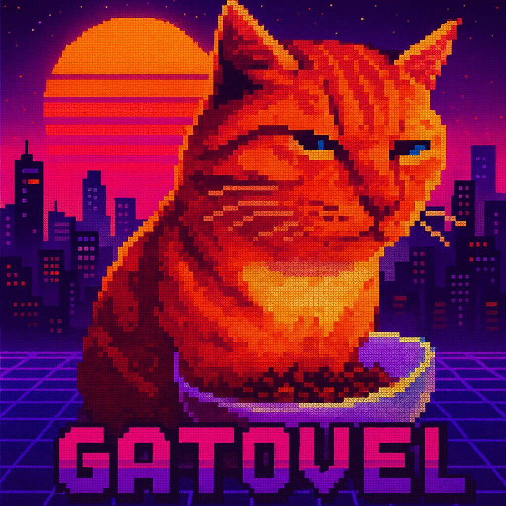

# Gatovel Framework

  

  A modular and extensible PHP framework for building modern web applications.

---

## 🚀 Get Started

  
  
  

---

## 📚 Documentation

  
  
  
  

  
  
  

---

  <strong>Gatovel Framework</strong> 
  Modular. Extensible. Simple.

  <a href="LICENSE">MIT License</a>

